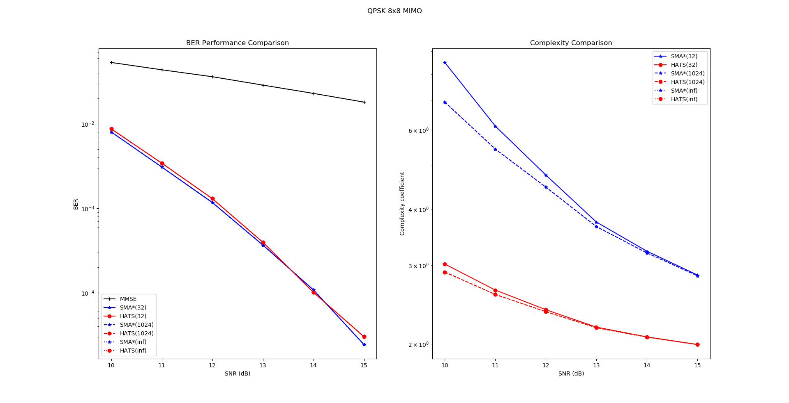
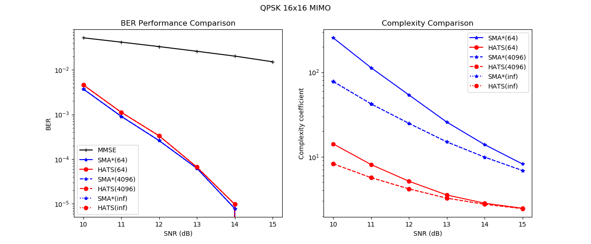

# Hyper-Accelerated Tree Search (HATS)
This is the repo for the paper entitled 
"Towards Optimally Efficient Tree Search with Deep Temporal Difference Learning". 
The key idea of this paper is to train the network towards the optimal heuristic. The associated paper has been submitted to IEEE Trans. Commun.. You can check the [Preprint](https://arxiv.org/abs/2101.02420) online if you are interested.

## Requirements
To run the code you have to fullfill the following dependencies,
* `matplotlib>=3.1`
* `tabulate>=0.8`
* `numpy>=1.16`
* `pytorch >= 1.5`
* `sortedcontainers>=2.3`

## Benchmark
You can change `n_ant` and `snr_list` and then run `python test.py` to see the result. 
Note that only `n_ant in [4, 8, 12, 16, 20, 24, 28, 32]` and `snr_list in range(5, 26)` are supported by the out-of-box, since we only train the model for these cases.

You may see some results like the following,
```
Testing n_ant=32 snr=13 packet=141/1000 timeslots=16/16 algorithms=7/7 HATS(inf)..
NAME         BER                             PRECISION  STEPS
-----------  ---------------------------  ------------  ------------------
MMSE         2.495429e-02(3603.0/144384)  6.925975e-06  0.00/0.00
SMA*(128)    2.077793e-05(3.0/144384)     6.925975e-06  22976.27/261657.90
HATS(128)    3.462987e-05(5.0/144384)     6.925975e-06  347.41/1233.47
SMA*(16384)  2.077793e-05(3.0/144384)     6.925975e-06  22976.27/61161.44
HATS(16384)  3.462987e-05(5.0/144384)     6.925975e-06  347.41/700.78
SMA*(inf)    2.077793e-05(3.0/144384)     6.925975e-06  22976.27/45952.54
HATS(inf)    3.462987e-05(5.0/144384)     6.925975e-06  347.41/700.78
```





## Under Construction
TBD

## License
Anti 996 License Version 1.0

[](https://github.com/996icu/996.ICU/blob/master/LICENSE)
<a href="https://996.icu"></a>
